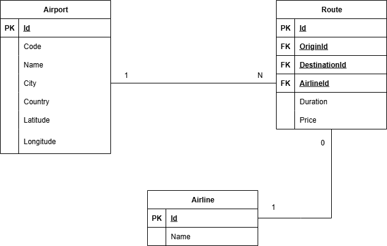

# Airport Travel Advisor #

## Table of Contents ##

- [Overview](#overview)
- [Setup](#setup)
- [Authentication](#authentication)
- [Database Schema](#database-schema)
- [Endpoints](#endpoints)
  - [Airports](#airports)
    - [`GET /api/airports`](#get-apiairports)
    - [`POST /api/airports`](#post-apiairports)
    - [`DELETE /api/airports/:id`](#delete-apiairportsid)
  - [Airlines](#airlines)
    - [`GET /api/airlines`](#get-apiairlines)
    - [`GET /api/airlines/:id`](#get-apiairlinesid)
    - [`POST /api/airlines`](#post-apiairlines)
    - [`DELETE /api/airlines/:id`](#delete-apiairlinesid)
  - [Routes](#routes)
    - [`GET /api/routes`](#get-apiroutes)
    - [`POST /api/routes`](#post-apiroutes)
    - [`DELETE /api/routes/:id`](#delete-apiroutesid)
  - [Flights](#flights)
    - [`GET /api/flights`](#get-apiflights)
    - [`POST /api/flights`](#post-apiflights)
    - [`DELETE /api/flights/:id`](#delete-apiflightsid)

## Overview

The Airport Travel Advisor is a smart travel planning system designed to help users find the most efficient flight routes between any two airports. Whether direct flights are available or not, the system evaluates multiple flight options, including layovers, estimated travel times, and total costs, to present the most convenient and cost-effective journey.

The core objective is to simulate a real-world flight booking assistant that can:
- Identify all possible flight routes between two airports
- Account for flight schedules, durations, and layovers
- Calculate and compare travel costs
- Recommend alternative routes when direct flights are unavailable

This project can be especially useful for applications like virtual travel agents or booking systems.

## Setup

1. Clone this repository.
2. Install dependencies:

   ```bash
   npm install
   ```

3. Create a `.env` file in the root with the following keys:

   ```env
   PORT=3000

   DB_HOST=localhost
   DB_USER=yourDBUser
   DB_PASSWORD=yourDBPassword
   DB_NAME=my_api
   DB_PORT=5432

   ADMIN_USERNAME=admin
   ADMIN_PASSWORD=supersecret

   JWT_SECRET=myjwtsecret
   JWT_EXPIRES_IN=3600

   # For simpler timestamps handling in Node
   TZ=UTC
   ```

4. Run the server:

   ```bash
   npm start
   ```

5. Access the API at:

   ```
   http://localhost:3000
   ```

## Authentication

The application uses a custom JWT-based authentication mechanism. Only authenticated **admins** can create, update or delete resources.
- The `POST /register` endpoint is restricted to admins and is used to create new admin accounts.
- The `POST /login` endpoint validates credentials and returns a Bearer token that must be included in the `Authorization` header for protected routes.

## Database Schema



## Endpoints

### Airports

#### `GET /api/airports`
List all airports.

#### `POST /api/airports`
Add a new airport (admin only).

```
POST /register
Content-Type: application/json
Authorization: Bearer <token>

{
  "code": "HND",
  "name": "Tokyo Haneda",
  "city": "Tokyo",
  "country": "Japan",
  "latitude": 35.5494,
  "longitude": 139.7798
}
```

#### `DELETE /api/airports/:id`
Delete an airport by ID (admin only).

### Airlines

#### `GET /api/airlines`
List all airlines.

#### `GET /api/airlines/:id`
List all routes operated by the airline with the specified ID.

#### `POST /api/airlines`
Add a new airline (admin only).

```
POST /register
Content-Type: application/json
Authorization: Bearer <token>

{
  "name": "American Airlines"
}
```

#### `DELETE /api/airlines/:id`
Delete an airline by ID (admin only).

### Routes

Routes represent the logical connections between two airports operated by an airline. They define which origin-destination pairs exist, but do not contain information about specific dates or times.

#### `GET /api/routes`
List all routes.

#### `POST /api/routes`
Add a new route (admin only).

```
POST /register
Content-Type: application/json
Authorization: Bearer <token>

{
  "originId": 5,
  "destinationId": 4,
  "duration": 100,
  "price": 500,
  "airlineId": 3
}
```

#### `DELETE /api/routes/:id`
Delete a route by ID (admin only).

### Flights

Flights are specific instances of a route scheduled for a particular date and time.

#### `GET /api/flights`
List possible flights.
- Query Parameters
  - `origin` and `destination`: When both are specified, results are filtered to flights departing from the airport with ID `origin` and arriving at the airport with ID `destination`. If only one is provided, both are ignored.
  - `date`: Filter flights by departure date. Optional.

#### `POST /api/flights`
Add a new flight (admin only).

```
POST /register
Content-Type: application/json
Authorization: Bearer <token>

{
  "routeId": 6,
  "departureTime": "2025-09-08 19:00:00",
  "arrivalTime": "2025-09-09 02:30:00"
}
```

#### `DELETE /api/flights/:id`
Delete a flight by ID (admin only).
