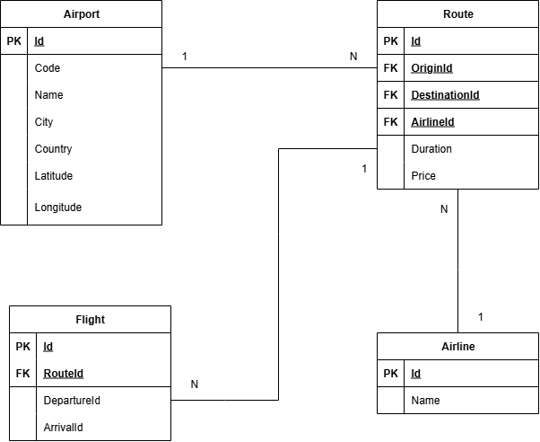

# Airport Travel Advisor #

## Table of Contents ##

- [Overview](#overview)
- [Setup](#setup)
- [Authentication](#authentication)
- [Database Schema](#database-schema)
- [Endpoints API Documentation](#endpoints-api-documentation)
  - [Airports Overview (api/airports)](#airports-overview-apiairports)
    - [GET api/airports](#get-apiairports)
    - [POST api/airports](#post-apiairports)
    - [DELETE api/airports](#delete-apiairports)
  - [Airlines Overview (api/airlines)](#airlines-overview-apiairlines)
    - [GET api/airlines](#get-apiairlines)
    - [POST api/airlines](#post-apiairlines)
    - [DELETE api/airlines](#delete-apiairlines)
  - [Routes Overview (api/routes)](#routes-overview-apiroutes)
    - [GET api/routes](#get-apiroutes)
    - [POST api/routes](#post-apiroutes)
    - [DELETE api/routes](#delete-apiroutes)
  - [Flights Overview (api/flights)](#flights-overview-apiroutes)
    - [GET api/flights](#get-apiflights)
    - [POST api/flights](#post-apiflights)
    - [DELETE api/flights](#delete-apiflights)

## Overview

The Airport Travel Advisor is a smart travel planning system designed to help users find the most efficient flight routes between any two airports. Whether direct flights are available or not, the system evaluates multiple flight options, including layovers, estimated travel times, and total costs, to present the most convenient and cost-effective journey.

The core objective is to simulate a real-world flight booking assistant that can:
- Identify all possible routes between two airports
- Account for flight schedules, durations, and transfers
- Calculate and compare travel costs
- Recommend alternative routes when direct flights are unavailable

This project can be especially useful for applications like virtual travel agents or booking systems.

## Setup

1. Clone this repository.
2. Install dependencies:

   ```bash
   npm install
   ```

3. Create a `.env` file in the root with the following keys:

   ```env
   PORT=3000
   ADMIN_USERNAME=admin
   ADMIN_PASSWORD=supersecret
   JWT_SECRET=myjwtsecret
   JWT_EXPIRES_IN=3600
   ```

4. Run the server:

   ```bash
   npm start
   ```

5. Access the API at:

   ```
   http://localhost:PORT
   ```

## Authentication

The application uses a JWT-based mechanism implemented from scratch. Only authenticated **admins** can create, update or delete resources.
- The `POST /register` endpoint is restricted to admins and is used to create new admin accounts.
- The `POST /login` endpoint validates credentials and returns a Bearer token that must be included in the `Authorization` header for protected routes.

## Database Schema



## Endpoints API Documentation

### Airports Overview (api/airports)

#### GET api/airports
List airports.

#### POST api/airports
Add new airport (admin only).

#### Delete api/airports
Delete an airport by id (admin only).

### Airlines Overview (api/airlines)

#### GET api/airlines
List airlines.

#### POST api/airlines
Add new airline (admin only).

#### Delete api/airlines
Delete an airline by id (admin only).

### Routes Overview (api/routes)

Routes represent the logical connections between two airports operated by an airline. They define which origin-destination pairs exist, but do not contain information about specific dates or times.

#### GET api/
List all routes.

#### POST api/routes
Add new route (admin only).

#### Delete api/routes
Delete a route by id (admin only).

### flights Overview (api/flights)

Flights are specific instances of a route occurring at a particular date and time.

#### GET api/flights?origin=X&dest=Y
List possible flights from airport with id X to airport with id Y, or all flights if no parameters are provided.

#### POST api/flights
Add new flight (admin only).

#### Delete api/flights
Delete a flight by id (admin only).
